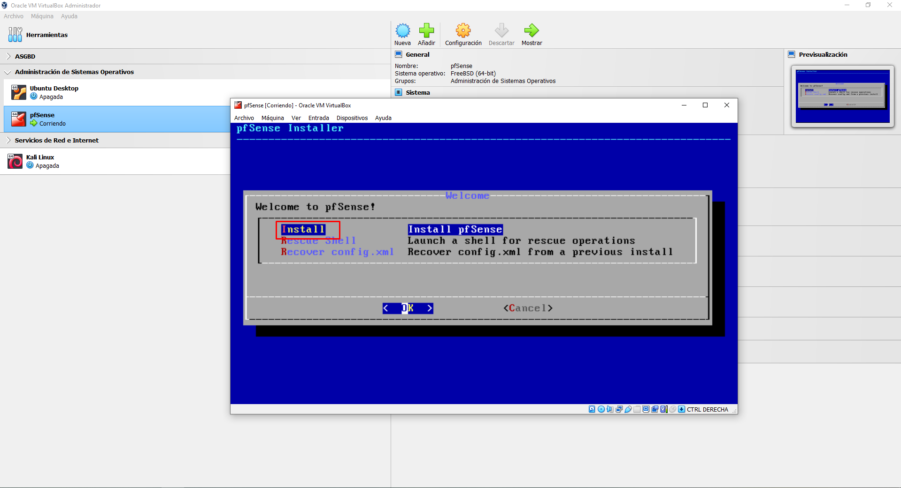
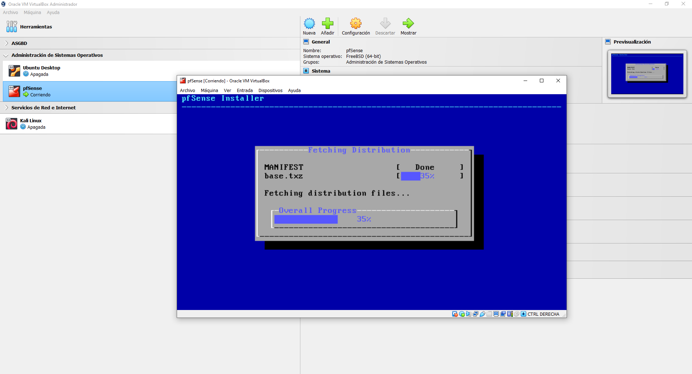
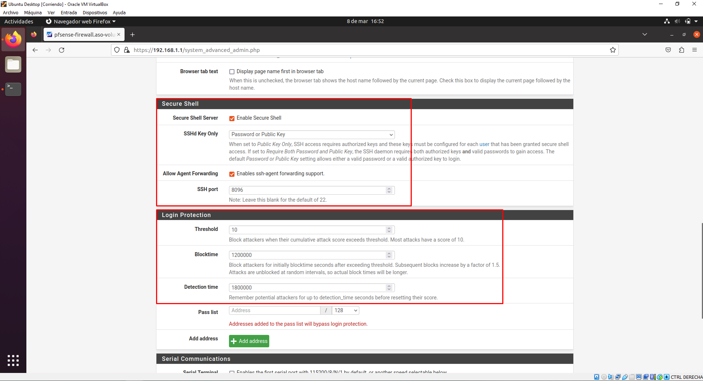
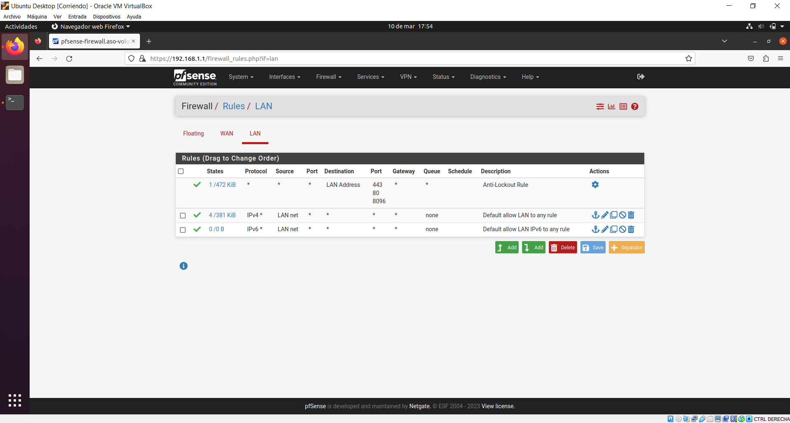
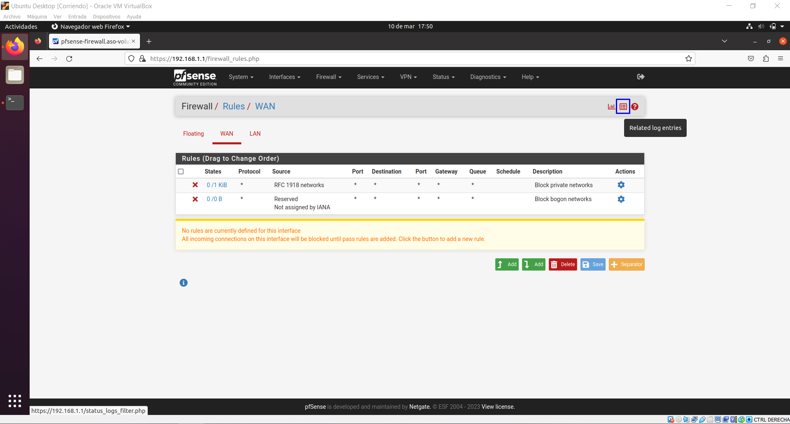
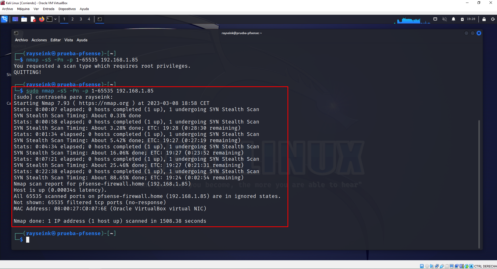

# Instalación, configuración de pfSense y pruebas de pentesting

***pfSense*** es un sistema operativo basado en FreeBSD y es de código abierto que actúa principalmente como cortafuegos y también actúa como router, servidor de DHCP, servidor DNS...

Como cortafuegos, es un UTM (Unified Threat Management) y tiene las siguientes características:

1. **Firewall de estado**: Inspecciona cada paquete que ingresa o sale de la red para determinar si son maliciosos o no.

2. **VPN**: Permite conexiones seguras y cifradas a través de la red.

3. **Filtrado de contenido**: Puede filtrar y bloquear contenido web específico.

4. **Protección contra ataques DoS**: Protege la red contra ataques de denegación de servicios para evitar la interrupción de los servicios.

5. **Monitoreo de tráfico**: Permite la monitorización del tráfico de la red para identificar y solucionar problemas de rendimiento y seguridad en tiempo real.

6. **Autenticación de usuario**: Permite la integración con sistemas de autenticación.

7. **IPS / IDS**: Tiene detección y prevención de intrusos para detectar y bloquear ataques maliciosos.

8. **Control de ancho de banda**: Permite limitar el ancho de banda a aplicaciones específicas o para usuarios concretos.

## Instalación de pfSense

[Descarga oficial de pfSense](https://www.pfsense.org/download/)

Para realizar la instalación de *pfSense*, hay que seleccionar la arquitectura de pfSense, están disponibles para AMD64 (64 bits) como para dispositivos Netgate, como en mi caso estoy con máquina virtual, **seleccionaré AMD64** y hay dos opciones, la ISO o el USB Memstick Installer, de igual forma, cómo es máquina virtual, **seleccionaré la ISO**.

Mientras se descarga la ISO o si se ha descargado, iremos creando la configuración de la máquina virtual, el tipo de máquina será ***BSD*** y como **versión FreeBSD (64 bit)**, si en este punto tenemos descargada la ISO, la seleccionaremos para que se monte en la máquina virtual.

En los ajustes hardware, asignaremos tanto memoria RAM como cantidad de núcleos del procesador según la cantidad de máquinas virtuales que vayamos a tener junto con pfSense, **al menos para que funcione correctamente usaremos 1GB de RAM y un núcleo de procesador**.

En cuanto al disco duro, tendremos en cuenta las máquinas que vayamos a tener y asignaremos una cantidad de disco duro, al menos deberá tener 16GB de disco.

Una vez hayamos acabado de crear la máquina virtual, configuraremos los parámetros de red, deberá tener al menos una interfaz que actúe como WAN (Adaptador puente o NAT) y otra como red local o interna (Red interna).

Cuando hayamos acabado con la configuración, arrancaremos la máquina virtual, la dejaremos que continúe por defecto hasta que nos salga el Copyright que deberemos pulsar la tecla Intro.

A continuación, nos dará a elegir entre instalar el sistema operativo, rescatarlo o recuperar el archivo config.xml del sistema que hubiese anteriormente, **como es un disco duro limpio**, **pulsaremos la tecla Intro sobre Install**.

Elegiremos la distribución de teclado que se asemeje a la nuestra y podemos probarla para cerciorarnos de que es la que usamos, en cuanto la hayamos probado, **pulsaremos la tecla Intro sobre Continue with <keyboard_distro>**

Para el particionado del disco, disponemos de varias opciones, la mejor por defecto es ***Auto (UFS) BIOS*** o ***Auto (UFS) UEFI*** según la placa base, en este caso como es máquina virtual, seleccionaré **Auto (UFS) BIOS**.

Después de seleccionar el particionado del disco, comenzará con la instalación del sistema operativo según el particionado que hayamos elegido o configurado.

Una vez haya finalizado la instalación del sistema operativo, nos preguntará si queremos realizar algunas modificaciones manuales del sistema antes de salir del wizard de instalación, **en este caso pulsaremos la tecla Intro sobre No**.

Antes de finalizar, nos volverá a preguntar, si queremos reiniciar el sistema o queremos abrir una consola Shell, pulsaremos la tecla Intro sobre Reboot para comenzar con el reinicio y después quitaremos la ISO de instalación de pfSense.

Tras el reinicio, empezará el sistema a configurarse, de forma que las interfaces de red si no tienen ningún problema de caída se configurarán automáticamente, en caso contrario, tendremos que indicar cuál es la interfaz WAN y LAN. Si no ha habido ningún problema, veremos las interfaces de red configuradas y un menú de opciones.

## Configuración de pfSense

### Configuración general

***Desde la máquina pfSense no podemos realizar configuración***, aunque sí podemos realizar algunos cambios desde pfSense, de forma que necesitamos otra máquina para que se conecte con pfSense a través del navegador web, preferiblemente desde la red interna.

En este caso estoy usando un Ubuntu Desktop 20.04 LTS con una única interfaz en Red Interna, **desde la consola de comandos usaremos el comando ip a para comprobar que tiene una IP dinámica**.

Abriremos un navegador web y pondremos en la barra de direcciones la IP que tiene pfSense en la red interna, nos saldrá un aviso indicando que hay riesgo potencial de seguridad, de forma que **pulsaremos en el botón Avanzado y a continuación en Aceptar el riesgo y continuar**. Esto es debido a que pfSense tiene un certificado autofirmado que no reconoce el navegador web.

Nos pedirá credenciales de acceso, las cuáles por defecto son admin (usuario) y pfsense (contraseña), **las introduciremos y pulsaremos en el botón SIGN IN**.

Tras acceder con las credenciales, nos saldrá un wizard para configurar pfSense, saltaré los pasos innecesarios, cambiaremos el Hostname de pfSense y el Domain, además de añadir un par de servidores DNS para disponer de conectividad fuera de la red interna.

El siguiente paso es establecer una contraseña para el acceso a pfSense, en este caso usaré el comando **openssl rand** para generar usando base 64 y que le de 20 caracteres (son más de 20) directamente a un fichero (no existe anteriormente).

Copiaré la contraseña generada y la asignaré para el acceso a pfSense.

Por último, tendremos que pulsar en el botón Reload para aplicar los cambios realizados.

Si abrimos la máquina que contiene pfSense, veremos que ha añadido al menos una línea que indica que nos hemos conectado desde Ubuntu, indicando la IP de conexión.

Una vez hayamos finalizado con la configuración, estaremos en el dashboard de pfSense, el cuál nos da información sobre el sistema, los recursos usados...

pfSense dispone de un menú, empezaremos con *System*, que contiene principalmente opciones de configuración generales de pfSense que se recogen en **Advanced**.

Podemos configurar el tipo de protocolo para la administración de pfSense, el puerto desde el que se sirve, la cantidad de procesos que pueden haber abiertos... En esta parte **configuraremos la cantidad de procesos (Max Processes) a 1** para evitar que se pueda acceder desde varias máquinas de forma simultánea.

Bajaremos hasta el apartado de **Secure Shell**, dónde habilitaremos el acceso a pfSense para poder acceder remotamente en el caso de que se necesite reiniciar, apagar, configurar de forma básica la máquina entre otras opciones. También habilitaremos el ssh-agent forwarding y cambiaremos el puerto desde el que se puede acceder mediante SSH. En el siguiente apartado, **Login Protection**, podemos establecer el umbral para bloquear los ataques que superen el contador establecido, la cantidad de tiempo de bloqueo y el tiempo que se recordará antes de reiniciar su contador. También podemos asignar un equipo o más para que pueda acceder desde el navegador a la configuración de pfSense.

Por último, ***tenemos que bajar y pulsar el botón Save ya que en caso contrario no se guarda la configuración realizada***.

### Firewall

El siguiente paso será configurar el cortafuegos, para ello, desde el menú de la parte superior, en **Firewall**, pulsaremos sobre **Rules**.

Por defecto, vienen dos reglas de base que bloquean el tráfico de la WAN hacia la LAN, las dos reglas que vienen por defecto no se pueden deshabilitar, por lo que habría que borrarlas. Para administrar las reglas, deberemos usar los botones que hay debajo de las reglas, de forma que podemos crear (arriba o abajo), borrar, guardar o crear un separador.

También podemos administrar las reglas de la LAN, de forma que únicamente tenemos que cambiar de pestaña, de base vienen tres reglas que permiten el acceso desde la LAN a la WAN y su entrada en la LAN debido a una conexión saliente.

Para ver los logs, pulsaremos en el botón marcado en la imagen para acceder a ellos.

De base, el firewall guarda hasta 500 entradas, de forma que cuando se superen, empezará a borrar las anteriores. En estos logs están tanto la red WAN como la LAN.

## Prueba de pentesting desde Kali Linux

Colocaré una máquina Kali Linux en la red WAN para comprobar que funciona correctamente, la IP que tiene la máquina es la 192.168.1.138, de forma que luego podamos ver en los logs la máquina que ha tratado de atacar a pfSense. Usaremos el comando **sudo nmap -sS -Pn -p 1-65535 192.168.1.1** de forma que con el modificador **-sS** realizamos un escaneo para comprobar el estado de los puertos, con **-Pn** no realizaremos un ping para evitar que pfSense detecte el escaneo, luego con **-p 1-65535** indicamos los puertos que queremos escanear y por último la IP a la que vamos a realizar el escaneo, en este caso la IP de pfSense. Este proceso es largo, por lo que hay que tener paciencia.

Una vez termine el escaneo, vemos que no hemos obtenido resultados y que por tanto no podemos realizar pruebas de penetración en pfSense.

Para finalizar, accederemos a los logs de pfSense y desde **Summary** vemos que ha registrado la IP de Kali Linux.
